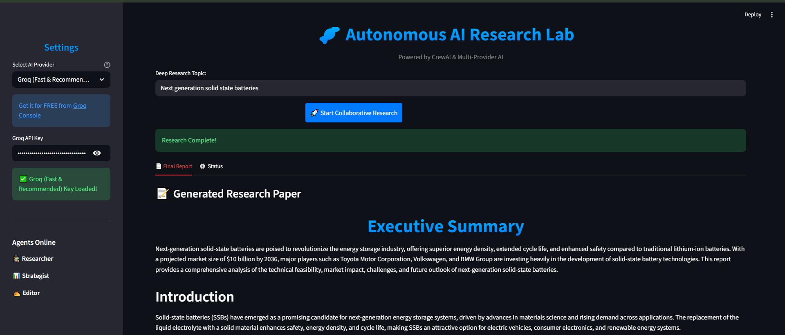

# 🧬 Autonomous AI Research Lab (Multi-Agent System)

A professional-grade **Multi-Agent System (MAS)** built with **CrewAI**, **Streamlit**, and **Google Gemini / Groq**. This project demonstrates autonomous collaboration between specialized AI agents to produce high-fidelity technical research reports.


## 🚀 Key Features

- **Autonomous Web Research**: Real-time information gathering using DuckDuckGo.
- **Strategic Analysis**: Intelligent categorization of findings into Technical Feasibility, Market Impact, and Challenges.
- **Professional Drafting**: Automated Markdown report generation by a specialized Scientific Editor.
- **Model Agnostic**: Seamlessly swap between **Google Gemini 2.0** and **Groq (Llama 3.3)**.
- **Rate-Limit Management**: Internal governor (`max_rpm`) to handle free-tier API constraints.
- **Robust Architecture**: Engineered for Windows with forced UTF-8 encoding and thread-safety.

## 🏗️ MAS Architecture

The system follows the **Corporate Analogy** (Agents as employees, Crew as the organization):

1.  **Lead Researcher**: Perception & Search (DuckDuckGo).
2.  **Technology Strategist**: Reasoning & Analysis (Categorization).
3.  **Scientific Editor**: Synthesis & Reporting (Formating).

### **Workflow Flowchart**
`User Input` ➔ `Lead Researcher (Search)` ➔ `Strategist (Analyze)` ➔ `Scientific Editor (Write)` ➔ `Final Markdown Report`

## 🛠️ Technical Stack

- **Framework**: [CrewAI](https://crewai.com)
- **Frontend**: Streamlit
- **LLMs**: Google Gemini 2.0 Flash / Groq Llama 3.3 70B
- **Search Engine**: DuckDuckGo (via LangChain)
- **Environment**: Python 3.11+ / Windows

## 📦 Installation & Setup

1. **Clone the repository**:
   ```bash
   git clone [REPLACE_WITH_YOUR_URL]
   cd AI_Research_Lab
   ```

2. **Create a Virtual Environment**:
   ```bash
   python -m venv venv
   source venv/bin/activate  # On Windows: venv\Scripts\activate
   ```

3. **Install Dependencies**:
   ```bash
   pip install -r requirements.txt
   ```

4. **Environment Variables**:
   Create a `.env` file or use the UI sidebar to enter your keys:
   - `GOOGLE_API_KEY`: Get from [AI Studio](https://aistudio.google.com/)
   - `GROQ_API_KEY`: Get from [Groq Console](https://console.groq.com/)

5. **Run the App**:
   ```bash
   streamlit run app.py
   ```

## 🎓 Theory & Concepts (MAS)

This project implements several core Multi-Agent System foundations:
- **Autonomy**: Agents make independent decisions based on their roles.
- **Social Ability**: Agents use **Request/Inform** speech acts via CrewAI's delegation system.
- **Knowledge Modeling**: Grounding through real-time perception (web search).
- **Shared Context**: Strategic passing of information through a sequential pipeline.

---
*Developed for the 9th iCog Training - Autonomous Multi-Agent Systems Task.*
